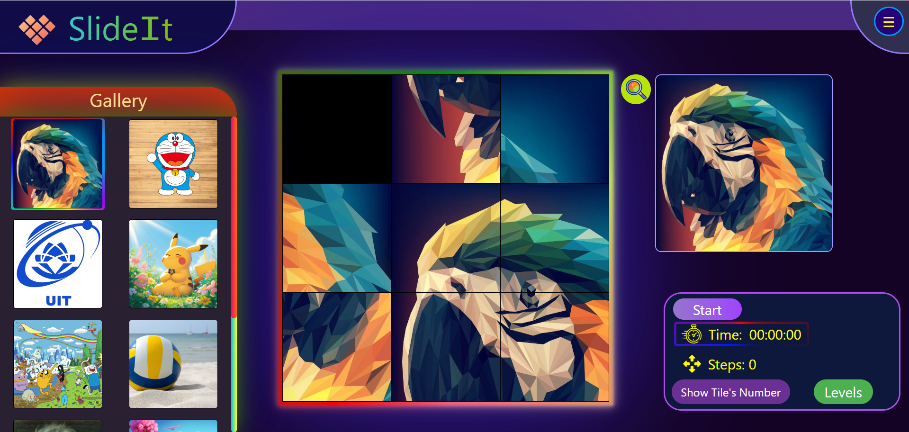

<a id="readme-top"></a>

# SlideIt - Slide puzzle web game

<summary>📑 Table of Contents</summary>
<ol>
  <li>
    <a href="#-project-overview">📝 Project Overview</a>
  </li>
  <li>
    <a href="#-main-components">🎮 Main Components</a>
  </li>
  <li>
    <a href="#-planned-features">🚀 Planned Features</a>
  </li>
  <li>
    <a href="#%EF%B8%8F-build-with">🛠️ Build with</a>
  </li>
  <li>
    <a href="#-getting-started">📂 Getting Started</a>
  </li>
  <li>
    <a href="#-license">🔑 License</a>
  </li>
</ol>

## 📝 Project Overview  
**Slide Puzzle** is a fun and classic sliding tile game where you rearrange pieces to complete the original picture.  
I designed it with a **colorful** and **easy-to-use** interface, so it’s great for beginners, but also challenging enough for anyone who wants to test their skills with different difficulty levels or complete in the shortest time

The main goal of this project was to **level up my frontend skills** by putting into practice what I’ve learned in **HTML**, **CSS**, and **JavaScript**.  
It’s my **first real project**, built after 4 months of learning — and it marks an important step in my journey of becoming a better web developer.  

  <a href="https://github.com/Loccovr2/Slide_Puzzle_Game">
    
  </a>
<p align="right">(<a href="#readme-top">back to top</a>)</p>

## 🎮 Main Components

1. **Board Game**
- A large game board that is easy to see on any screen size.
- Difficulty levels ranging from **3x3** up to **10x10**.
- Smooth animations and lively interactions for a more engaging experience.
- A **preview button** next to the board to preview the completed image.

2. **Gallery**
- A collection of images to change the puzzle picture — simply click an image to apply it.
- The currently selected image is clearly highlighted with an animation.
- Responsive design: the gallery can shrink to fit smaller screen widths, and will automatically expand to full size when hovered.

3. **Game Options**
- Contains essential controls for the board game and gameplay, including:
     - **Start**: shuffle the tiles into a solvable arrangement and begin playing, or reshuffle at any time.
     - **Restart**: restart the game from the beginning, with a confirmation prompt if the game is in progress.
     - **Pause**: pause the game and timer; resume by clicking again or moving a tile.
       ( **Pause** and **Restart** only appear after the first tile movement (when the timer starts) ).
     - **Timer**: tracks the completion time, starting on the first tile move. Includes animations to indicate whether the timer is running or paused.
     - **Steps**: counts the number of tile moves made until the puzzle is completed.
     - **Levels**: hover to display a list of available difficulty levels to choose from.
     - **Show Tile Numbers**: toggle to display tile numbers for easier puzzle solving.

<p align="right">(<a href="#readme-top">back to top</a>)</p>

## 🚀 Planned Features

- **Add & use favorite images from the Gallery**
  - Support adding new images to the gallery

- **Save play history**
  - Store results per game: board size, image used, time, steps, date
  - View recent sessions to track improvement

- **Ranking / Leaderboard**
  - Local leaderboard by difficulty (best time & fewest steps)
  - Online leaderboard in a future update
<p align="right">(<a href="#readme-top">back to top</a>)</p>

## 🛠️ Build with
<div style="display: flex; flex-wrap: wrap; gap: 10px; margin-bottom: 20px;">
  
  
  
</div>

<p align="right">(<a href="#readme-top">back to top</a>)</p>

## 📂 Getting Started

To open and play the Slide Puzzle game locally:

1. **Download or Clone the repository**
   ```bash
   git clone https://github.com/Loccovr2/Slide_Puzzle_Game.git
   cd Slide_Puzzle_Game

2. **Open the game in your browser**
  - Locate the file index.html in the project folder.
  - Double-click it, or right-click and choose Open With → select your preferred web browser (Chrome, Firefox, Edge, etc.).
  - The game will load automatically with all the linked CSS, JavaScript, and images.

💡**For the best experience** during development, open index.html using the Live Server extension in VSCode to automatically reload changes as you edit.

<p align="right">(<a href="#readme-top">back to top</a>)</p>

## 🔑 License

Distributed under the Unlicense License. See `LICENSE.txt` for more information.

<p align="right">(<a href="#readme-top">back to top</a>)</p>
